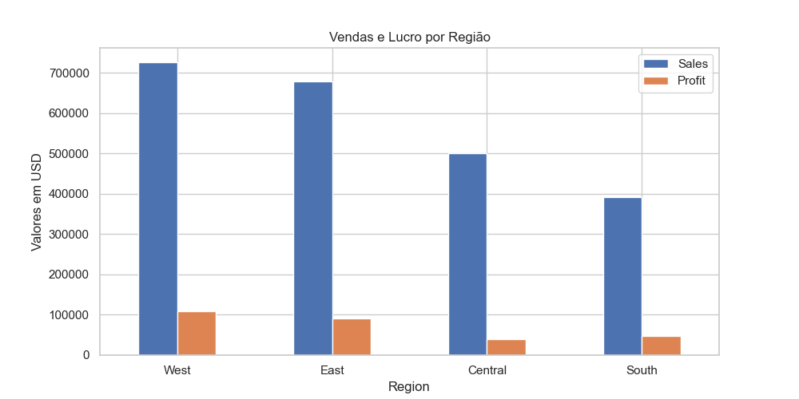
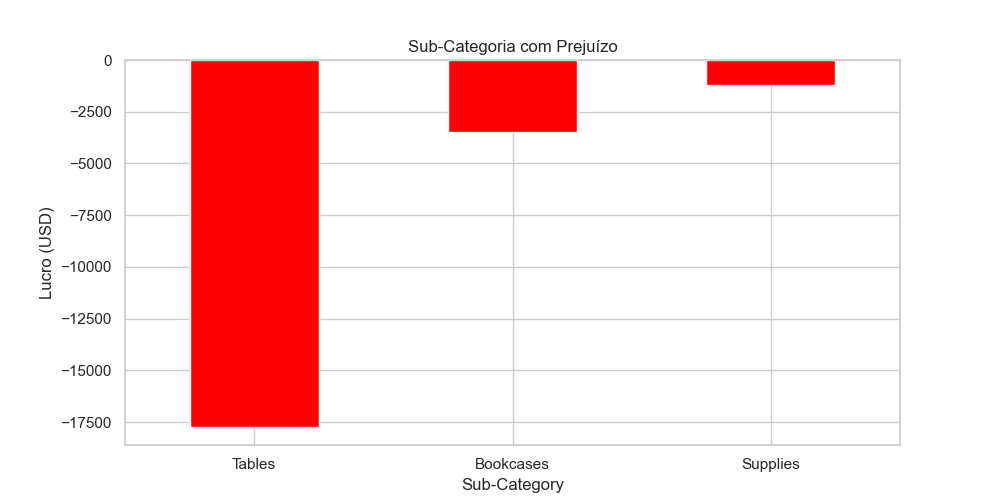

  

# 📊 Análise de Vendas - Superstore

Projeto de Análise de Dados utilizando Python e o conjunto de dados fictício da Superstore. O objetivo foi explorar, visualizar e extrair insights sobre as vendas, lucros, regiões, categorias e comportamentos do negócio com base em dados históricos.

---

## 🧭 Sumário

- [🧠 Objetivo](#objetivo)
- [📦 Dataset](#dataset)
- [🛠️ Ferramentas Utilizadas](#ferramentas-utilizadas)
- [📌 Principais Etapas](#principais-etapas)
- [📈 Principais Insights](#principais-insights)
- [📊 Exemplos de Visualizações](#exemplos-de-visualizacoes)
- [👤 Autor](#autor)

---

## 🧠 Objetivo

Entender os principais fatores que afetam o desempenho financeiro da empresa:
- Quais regiões geram mais lucro?
- Quais categorias ou produtos dão prejuízo?
- Qual o impacto do tipo de envio no lucro?
- Qual o desempenho por estado e segmento de cliente?

---

## 📦 Dataset

- **Nome:** Sample - Superstore.csv  
- **Fonte:** Kaggle (https://www.kaggle.com/datasets/vivek468/superstore-dataset-final)
- **Formato:** CSV  
- **Linhas:** ~10.000  
- **Colunas principais:** `Order Date`, `Sales`, `Profit`, `Region`, `Segment`, `Category`, `Sub-Category`, `State`, `Ship Mode`

---

## 🛠️ Ferramentas Utilizadas

- **Python 3.x**
- **Jupyter Notebook**
- **Bibliotecas:** 
  - `pandas`
  - `matplotlib`
  - `seaborn`

---

## 📌 Principais Etapas

1. **Importação e exploração inicial do dataset**
2. **Limpeza dos dados (nulos, tipos, duplicatas)**
3. **Criação de variáveis novas (tempo de entrega, ano-mês)**
4. **Análises por:**
   - Região
   - Estado
   - Segmento
   - Categoria e Subcategoria
   - Tipo de envio
   - Tempo de entrega
5. **Visualizações com Seaborn e Matplotlib**
6. **Resumo de insights e recomendações de negócio**

---

## 📈 Principais Insights

- A **Região Oeste** é a mais lucrativa; a **Sul** tem desempenho fraco.
- A subcategoria **"Tables"** gera **prejuízo**.
- O segmento **Corporate** é mais rentável que Consumer.
- Estados como **Texas** e **Illinois** estão operando no vermelho.
- **Tempo médio de entrega** entre 2 e 5 dias é comum e adequado.
- **Lucro varia bastante** ao longo do tempo, sugerindo sazonalidade.

---

### 📊 Exemplos de Visualizações

**Lucro por Região**

**Subcategorias com Prejuízo**

---

# 👤 Autor

**Higgor Sampaio Alves**  
Estudante de Ciência de Dados  
Em busca de aprendizado contínuo e visualizações impactantes.

📧 **Email:** [higgor.sampaio@gmail.com](mailto:higgor.sampaio@gmail.com)  
💼 **LinkedIn:** [Higgor Sampaio Alves](https://www.linkedin.com/in/higgor-sa/)  
💻 **GitHub:** [higgor-s-a](https://github.com/higgor-s-a)

---

## 📎 Conclusão

A análise indica oportunidades claras para aumentar a lucratividade da Superstore:
- Reduzir ou reformular a oferta de produtos deficitários
- Reavaliar a estratégia nos estados com prejuízo
- Explorar campanhas sazonais e fidelização de segmentos rentáveis

---